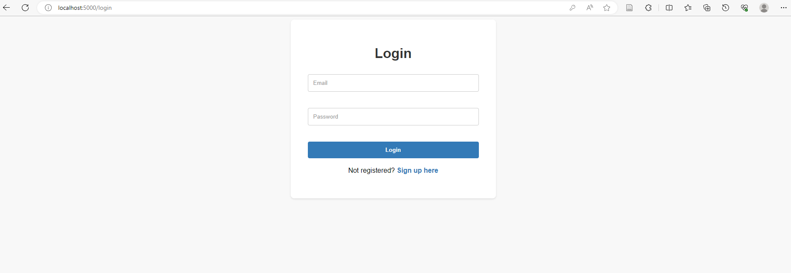
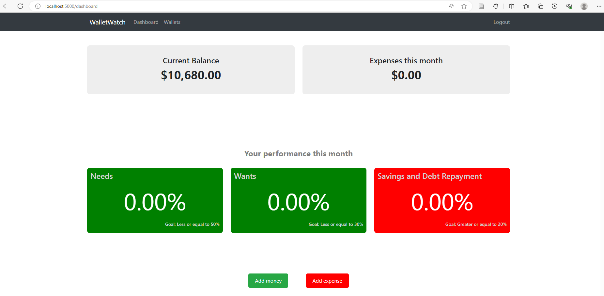
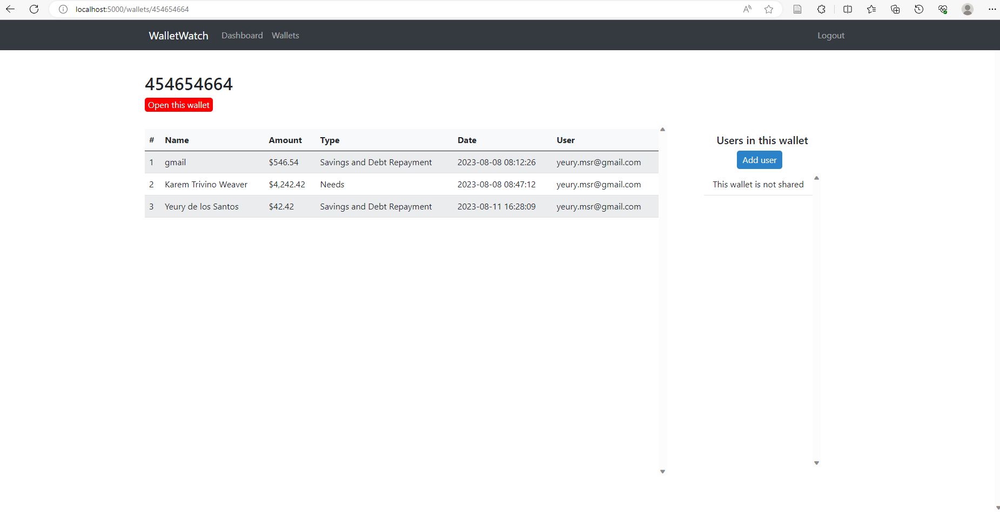

# WalletWatch

WalletWatch is a Python web application for tracking expenses and managing your finances. It uses MySQL as the default database and is built with Flask.

The application is intended to mimic real-life wallets hense the following;

1. Users need money in order to spend
2. Expenses cannot be deleted

### Features

1. Track and categorize your expenses
2. Integrates 'The rule of 50/30/20 for expenditure allocation guidance
3. Create wallets for especific expenses (e.g Vacations, John's Birthday)
4. Add users to your wallets so they can add expenses to the list (Only wallet owner can add, delete users or delete a shared wallet)









## Getting Started

### Prerequisites

- Python 3.x
- MySQL Server

### Installation

1. Start your MySQL service.

2. Clone the repository:

   ```bash
   git clone https://github.com/your-username/WalletWatch.git

## Start the project

1. Navigate to the project directory:
   cd path/walletwatch
   
2. Activate a virtual environment:
   walletwatch\Scripts\activate

3. Install dependencies:
   pip install -r requirements.txt

### Configuration

Create a MySQL database named "walletwatch".

# Current MySQL configuration

db = {
    "host": "localhost",
    "user": "cct",
    "password": "cctcollege2023*",
    "database": "walletwatch_db",
    "pool_size": 10,
}

### Run the application

python walletwatch.py

The application was also containerized using docker, to run through Docker do the following;

1. Open Docker desktop
2. Modify this line "host": "localhost", to "host": "db",
3. Stop MySQL serivce if it is running
4. Navigate to project path and run the following commands;

Docker compose up --build

### LICENSE

Intellectual Property: CCT College Dublin - 2023
Developer/Autor: Yeury de los Santos
Program: MSc in Applied Software Development


